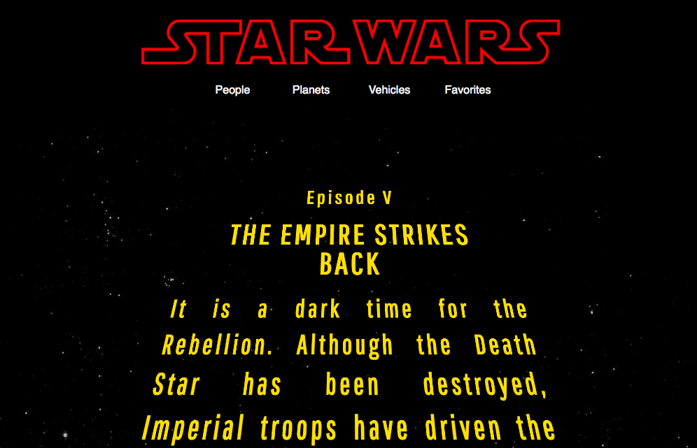
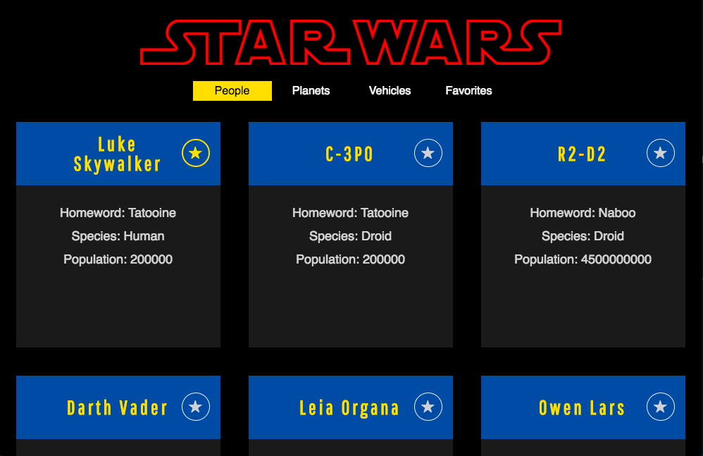

# SwapiBox

In this project for Turing's Front End Engineering program, I was asked to create a React App using data from the Star Wars API (SWApi). I implemented Router to handle page navigation, and all of the deeply nested asynchronous API calls required to pull the data for display were thoroughly tested with Enzyme and Jest. The landing page features a text crawl based on the opening sequence of the movies, with text randomly selected from one of the films. The application also features card pages with information about characters, planets, and vehicles found in the films, and a favorites page where users can view favorited cards

## Project Goals

* Separate application logic into small, testable functions.
* Create modular, reusable React components.
* propTypes validation for all props passed to components.
* Write meaningful, comprehensive unit and integration tests with complete coverage for all components and functionality of application.

### Landing view with Star Wars opening crawl: 

### Cards view displaying character cards: 

## Set Up

Fork this project

Run `npm install` from the root directory

Run `npm start` and visit localhost:3000 in your browser

## Testing

Begin running your tests with `npm test`
Initialize the enzyme adapter: [initializing the enzyme adapter](http://airbnb.io/enzyme/docs/installation/react-15.html) 
